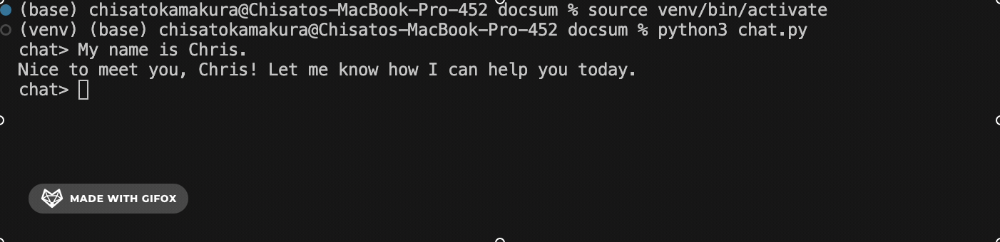

# lab-docsum 

[](https://github.com/chisatokamakura/lab-docsum/actions/workflows/doctest.yml)
[](https://github.com/chisatokamakura/lab-docsum/actions/workflows/integration-tests.yml)

[](https://pypi.org/project/cmc-cs040-chisatokamakura/)
[](https://codecov.io/gh/chisatokamakura/lab-docsum)

This project is a command-line LLM assistant. It contains a variety of tools that is able to be called both automatically and manually.

## This project demonstrates: 

1. How to write "test cases for your test cases"
2. How to get LLMs working in github actions
3. How to let other people "pip install" your projects

Link to my PYPI project: https://pypi.org/project/cmc-cs040-chisatokamakura/

## Animated GIF Demo: 



### Webpage Project

This example is good because it shows how the model can analyze a website project and its structure, identifying individual files that include HTML files, styling files, and images.

```
$ cd test_projects/chisatokamakura.github.io
$ chat
chat> what is in this project?
This project contains several HTML pages such as index.html, men.html, pairs.html, and icedance.html, along with a style.css file and many image assets. It appears to be a multi-page website with structured content and styling.
```

### Markdown Project

This example is good because it shows how the model can analyze a code-based project and identify its components, which include configuration files and output images.

```
$ cd test_projects/project01
$ chat
chat> what is in this project?
This project contains a markdown compiler implementation along with supporting files such as a README, configuration files (pyproject.toml and requirements.txt), and example outputs including screenshots demonstrating styling behavior.
```

### Webscraping Project

This is a good example because it shows how the model can interpret multiple types of files and reason about their properties and functionality.

```
$ cd test_projects/project02_webscraping
$ chat
chat> tell me about this project
This project appears to scrape product data from eBay listings and store the results in structured formats like CSV and JSON.

chat> what kind of data does it collect?
The project includes multiple CSV and JSON files, suggesting it collects and stores product information such as listings for items such as cameras, sweaters, and typewriters.
```